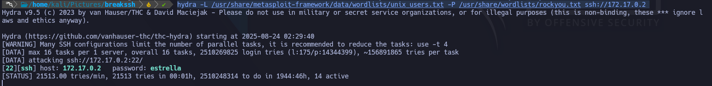
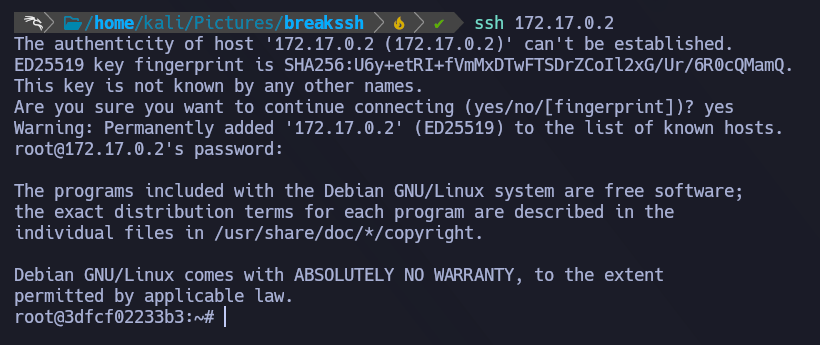

## 🐋 Docker Lab - Breakmyssh 

    Difficulty: Very Easy
    SO: Linux

# Reconocimiento
1.- Primero utilzaremos nmap con el siguiente comando ''nmap -p- --open -T5 -n -Pn 172.17.0.2  
- -p- -> Escanea todos los puertos (6535)
- --open -> Reporta todos los puertos abiertos
- -T5 -> Plantilla de tiempo (Agresivo)
- -n Desactiva la resolucion DNS
- -Pn Asume que todos los hosts se encuentran activos

El seervicio SSH se encuentra activo, ocupamos un nombre de usuario y una contraseña para poder logearnos. 

# Explotacion
Revisando, vemos que no tenemos mas info para trabajar, por lo tanto aplicaremos fuerza bruta utilizando ''HYDRA''  
- hydra -L /usr/share/metasploit-framework/data/wordlists/unix_users.txt -P /usr/share/wordlists/rockyou.txt ssh://172.17.0.2
- -L -> Dado que no tenemos el nombre de usuario, le pasamos un diccionario.
- -P -> Dado que no tenemos una contraseña, pasamos un diccionario.

Con la contraseña, podemos probar conectarnos sin usuario.  

Directamente nos conecta como root, por ende tenemos privilegios de superusuario. 
