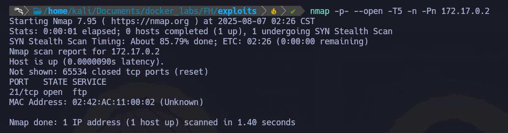
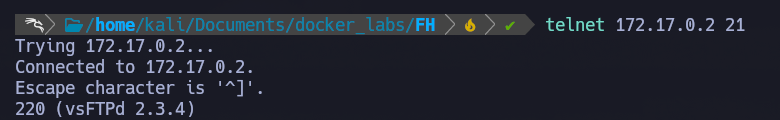
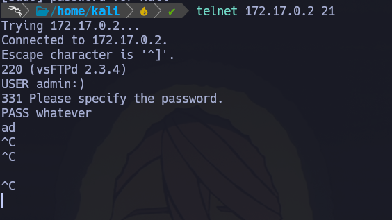
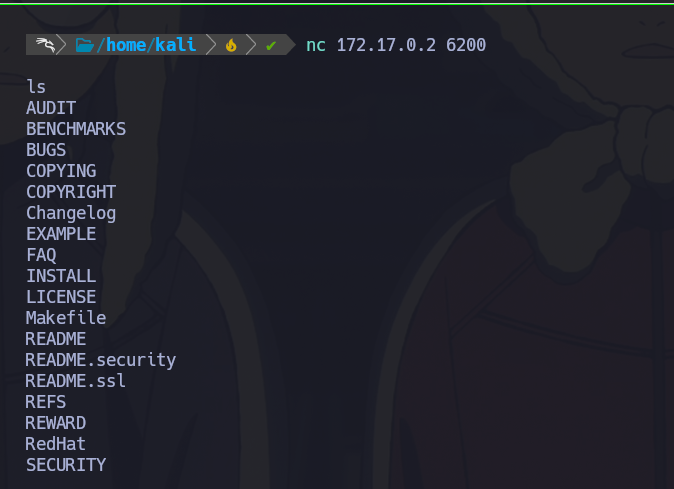
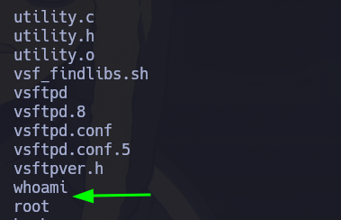
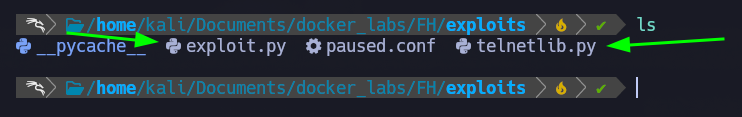
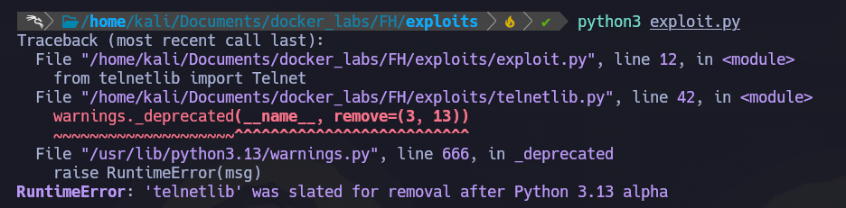
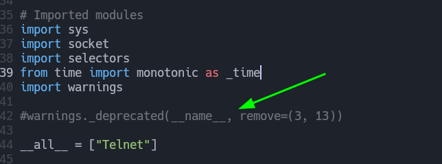
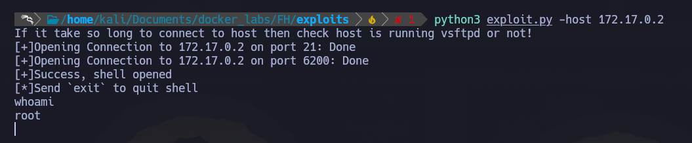

🐋 Docker Lab - First hacking  
- Difficulty: Very easy 
- SO: Linux

#🎯 Reconocimiento
1.- Empezamos lanzando un escaneo con nmap 
nmap -p- --open -T5 -n -Pn 172.17.0.2 
- -p- -> Escanea todos los puertos (0-65535)
- --open -> Muestra todos los puertos abiertos, imporante recalcar que muestra unicamente los puertos abiertos
- -T5 -> Planilla de tiempo, en este caso elegimos la mas agresiva ya que estamos en local.
- -n -> Para que no ejecute resolucion DNS
- -Pn -> Asume que todos los host de una red se encuentran encendidos.
 

2.- Como vemos, tenemos el puero 21 abierto, ejecutando el servico FTP con la verison vsftpd 2.3.4  
Para verificar si esta version es vulnerable, hay varias opciones
- 1.- Realizar pruebas
- 2.- Investigar directamente en internet
- 3.- Utilizando Metasploit (Ya sera en otra ocasion:))
Para abarcar mas, usaremos 2 opciones 
1.- Pruebas
  Lo primero, conectarnos al servicio FTP con el siguiente comando "telnet <IP> <PORT>" -> telnet 172.17.0.2 21
   
  Una vez conectados, tendremos que usar un usuario y agregar un password.
  Investigando un poco, parece que este backdoor se activa con ":)", agregado en 2011 cuando fue comprometido el sitio oficial.
  Sabiendo esto, probemos con "USER:admin:)" "PASS:whatever"
  

- Una vez logeados vemos como la consola no responde, se comporta de manera extraña, no permite ni usar ctrl+c

En otra terminal, nos conectaremos al puerto 6200 utilizando netcat "nc <IP> <PORT>" -> nc 172.17.0.2 6200
 
Como vemos, nos lanza una shell completamente funcional.
Usamos whoami para ver a que nivel tenemos la shell
 
Bien, como vemos conseguimos una shell a nivel root, lo que siginica que este laboratorio esta comprometido.

2.- Investigar en internet
- ESte metodo no es tan complicado, ya que pegamos directamente en google la version del servicio y buscamos alguna web que nos de el CVE de la version.
En este caso, yo utilizare un script creado por @padsalatushal
#Requisitos para el exploit 
Como el script fue creado para la version 3.12 de python y al menos mi version es la 3.13 (Actualmente), la libreria "telnet" la cual usa este script no es compatible con la version 3.13, por ende tenemos que descargar la libreria directemente en la carpeta donde se haya creado el exploit.py
Siendo de la siguiente manera:
 
Al ejecutar el script podria darnos el siguiente error:
 
Bien, para solucionar esto debemos editar el archivo "telnet.py" y buscar la linea que tenga el siguiente codigo "warnings._deprecated(__name__, remove=(3, 13))"
 
Una vez comentado, podemos ejecutar el codigo de manera normal agregando los parametros que nos pide.
 

  
