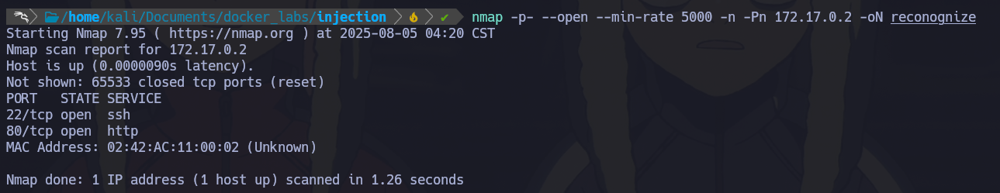

# 🐋 Docker Lab - Injection

Difficulty: Very Easy
SO: Linux 

Primero desplegamos el contendor, esto se hace de manera automatizada. Ejecutando un script de bash que ta viene configurado. 
![DespliegueDocker(./images/despliegue.png)

# 🎯 Reconocimiento 
Empezamos con un escaneo del contendor, como vimos este tiene la IP -> 172.17.0.2 ya que pertence al localhost
Comando: sudo nmap -p- --open --min-rate 5000 -n -Pn 172.17.0.2 
- -p- -> Escanea todos los puertos
- --open -> Muestra todos los puertos abiertos 
- --min-rate 5000 -> Realiza un envio de no menos 5000 paquetes 
- -n -> Evita que se aplique resolucion DNS
- -Pn -> Asume que todos los host se encuentran activos 
- -oN -> Ouput normal 

