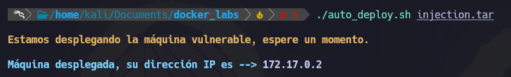
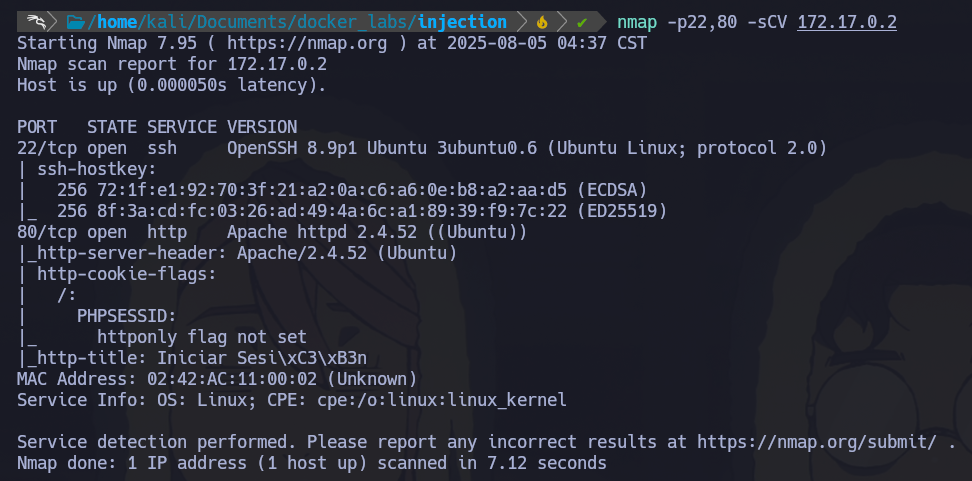

# 🐋 Docker Lab - Injection

- Difficulty: Very Easy
- SO: Linux 

Primero desplegamos el contendor, esto se hace de manera automatizada. Ejecutando un script de bash que ta viene configurado. 

# 🎯 Reconocimiento 
1.- Empezamos con un escaneo del contendor, como vimos este tiene la IP -> 172.17.0.2 ya que pertence al localhost  
Comando: sudo nmap -p- --open --min-rate 5000 -n -Pn 172.17.0.2 
- -p- -> Escanea todos los puertos
- --open -> Muestra todos los puertos abiertos 
- --min-rate 5000 -> Realiza un envio de no menos 5000 paquetes 
- -n -> Evita que se aplique resolucion DNS
- -Pn -> Asume que todos los host se encuentran activos 
- -oN -> Ouput normal 

2.- Una vez realizado el escaneo, vemos que tiene 2 puertos abiertos [22 - ssh]  y [80 - http]
  Ahora realizaremos un escaneo especificamente a estos puertos, utilizando un conjunto de scripts incluidos en Nmap para reconocer la version de estos servicios. 
  nmap -p22,80 -sCV 172.17.0.2
- -p22,80 -> Especificamos que queremos escanear estos dos puertos
- -sC -> Ejecuta un conjunto de scripts por default -sCV
- -sV -> Escanea puertos abiertos y las versiones de los servicios en ejecucion -sCV

