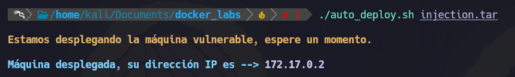
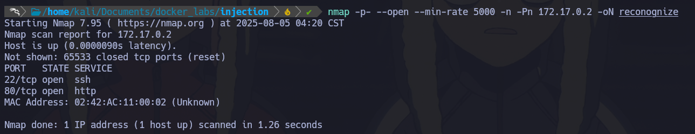
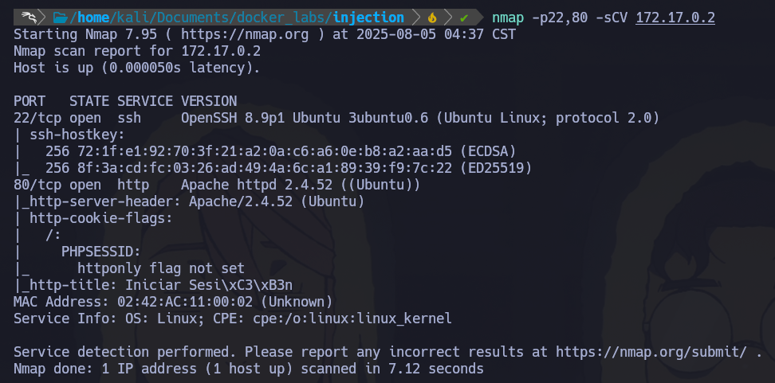
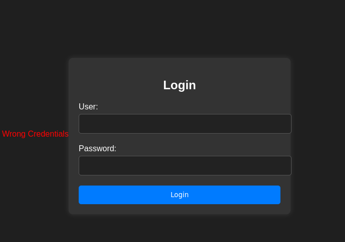
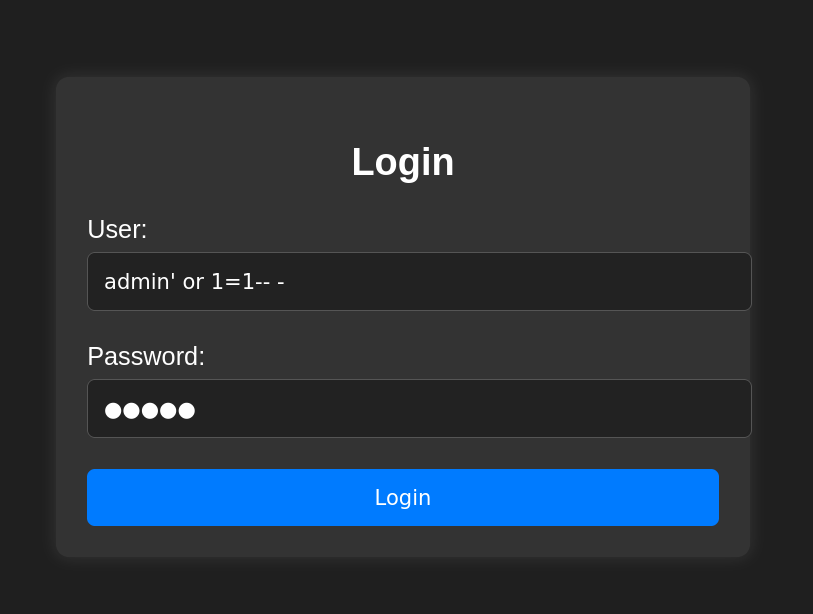
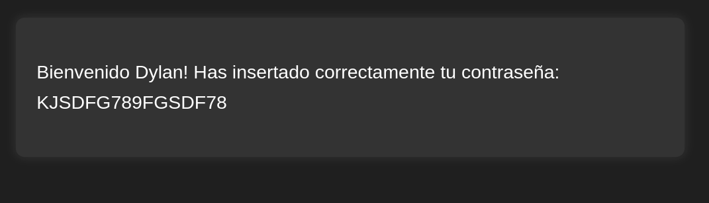
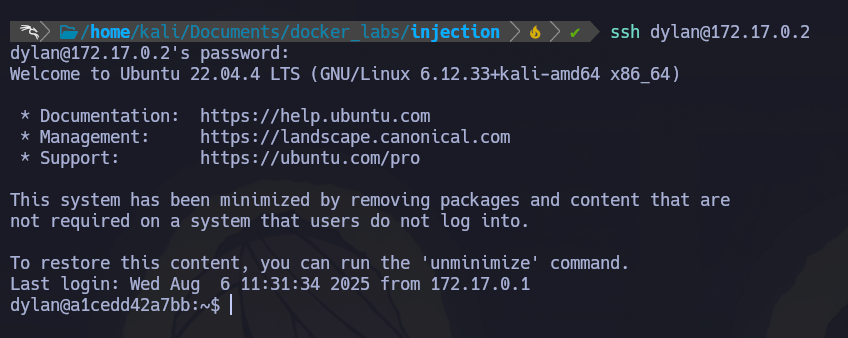
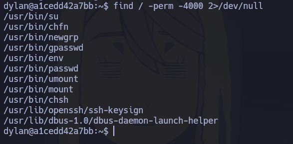
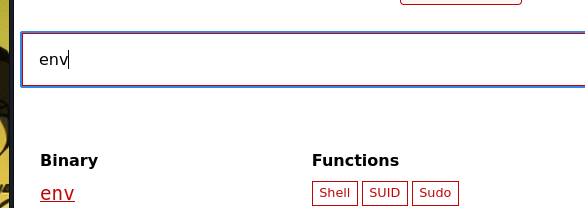
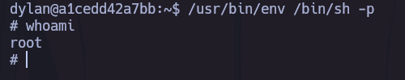

# 🐋 Docker Lab - Injection

- Difficulty: Very Easy
- SO: Linux 

Primero desplegamos el contendor, esto se hace de manera automatizada. Ejecutando un script de bash que ta viene configurado. 

# 🎯 Reconocimiento 
1.- Empezamos con un escaneo del contendor, como vimos este tiene la IP -> 172.17.0.2 ya que pertence al localhost  
Comando: sudo nmap -p- --open --min-rate 5000 -n -Pn 172.17.0.2 
- -p- -> Escanea todos los puertos
- --open -> Muestra todos los puertos abiertos 
- --min-rate 5000 -> Realiza un envio de no menos 5000 paquetes 
- -n -> Evita que se aplique resolucion DNS
- -Pn -> Asume que todos los host se encuentran activos 
- -oN -> Ouput normal 

2.- Una vez realizado el escaneo, vemos que tiene 2 puertos abiertos [22 - ssh]  y [80 - http]
  Ahora realizaremos un escaneo especificamente a estos puertos, utilizando un conjunto de scripts incluidos en Nmap para reconocer la version de estos servicios. 
  nmap -p22,80 -sCV 172.17.0.2
- -p22,80 -> Especificamos que queremos escanear estos dos puertos
- -sC -> Ejecuta un conjunto de scripts por default -sCV
- -sV -> Escanea puertos abiertos y las versiones de los servicios en ejecucion -sCV
  

# 💥 Explotacion 
Tiene el puerto 80 abierto, por lo tanto tiene una web levantada, visitemos la web. 

1.- Por el nombre de la maquina "injection", pasare directamente a probar un SQL Injection  
Una sentencia basica de SQL Injection "admin' or1=1-- -"  

#Explicacion sentencia " admin' or 1=1-- - " 
SELECT * FROM usuarios WHERE usuario = 'admin' OR 1=1-- -' AND contraseña = '';
- admin' or 1=1-- - -> Hace que la sentencia sea valida si o si, ya que 1=1 siempre es verdadero
- -- - -> Comenta el resto de la sentencia e ignora la validacion

2.- Bien, el login tiene un nombre de usuario "Dylan" y si recordamos, al realizar el reconocimiento vimos el puerto 22 (SSH) abierto, asi que inentaremos una conexion SSH usando el nombre de usuario "Dylan" y la contraseña que acabmos de conseguir.

3.- Escalada de privilegios 
Una vez dentro del sistema, inentaremos una escalada de privilegios 
Para realizar esto, buscaremos archivos con privilegios SUID

Verificamos estos binarios en GTFOBins para corroborar cual tiene permisos SUID

En la misma web de GTFOBins, vemos como ejecutar este binario.
Utilizando el siguiente comando
/usr/bin/env /bin/sh -p

Asi conseguimos una shell con usuario root! 

