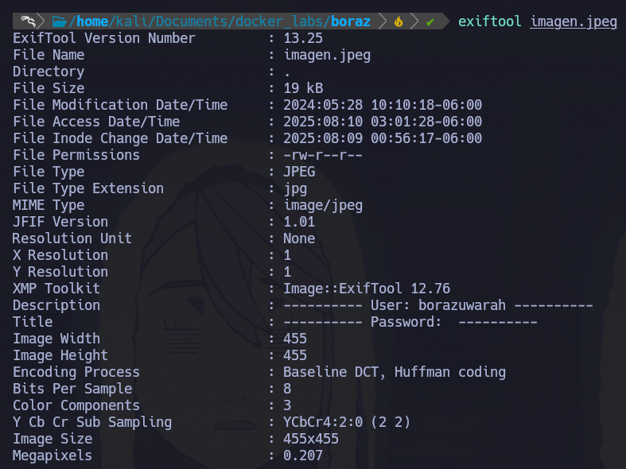

## 🐋 Docker Lab - borazuwarahctf 
- Difficulty: Very Easy
- SO:Linux

## 🎯 Reconocimiento
1.- Empezamos con un reconocimiento con nmap: 
'''nmap -p- --open --min-rate 5000 -n -Pn -vvv 172.17.0.3 -oN scanning'''
- -p- -> Escanea todos los puertos (65535)
- --open -> Reporta unicamente los puertos abiertos
- --min-rate -> Envia paquetes no minimos a 5000
- -n -> No aplica resolucion DNS
- -Pn -> Asume que todos los hosts se encuentran activos
- -vvv -> Triple verbose, detalla cada puertos descubierto.
- -oN Output normal  

2.- Observamos que tiene 2 puertos expuestos 
- Puerto 22 [SSH]
- Puerto 80 [HTTP]  
Veamos la web para saber que puede aportarnos.  

Bien, analicemos la imagen utilizando steghide.  
steghide --extract -sf imagen.png 
- --extract -> Extrae la informacion
- -sf -> Extrae informacion de un archivo/imagen
 
Hay un archivo .txt, lo leemos con "cat"
 

Ahora analizaremos la imagen con exiftool

## 🧨 Explotacion

Hay un usuario, podemos probar con SSH, pero no tenemos contraseña.  
Para conseguir esta contraseña, utilizaremos HYDRA para realizar un ataque de fuerza bruta, con el siguiente comando.  
hydra -l borazuwarah -P /usr/share/wordlists/rockyou.txt ssh://172.17.0.3     
- -l -> Si se tiene el usuario, de lo contraio utilizar -L y un diccionario con nombres de usuario
- -P -> Ya que no tenemos esta contraseña utilizamos un diccionario, en este caso rockyou.txt
- ssh://172.17.0.3 -> Servicio y Servidor (Host)

De acuerdo, ahora conectemonos al contenedor mediante SSH utilizando el usuario y password que conseguimos. 
 

Probemos enumeracicon de privilegios con "sudo -l"
- sudo -l -> Muestra una lista de comandos que puede ejecutar sudo sin necesidad de la cotraseña.  

Ahora ejecutemos esa bash que nos permite usar sin contraseña. 

Tenemos una bash como root, este contenedor a sido comprometido!

