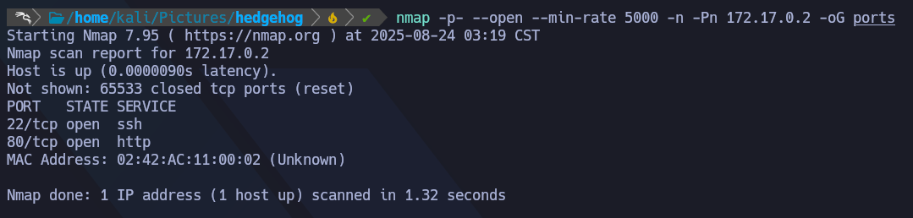
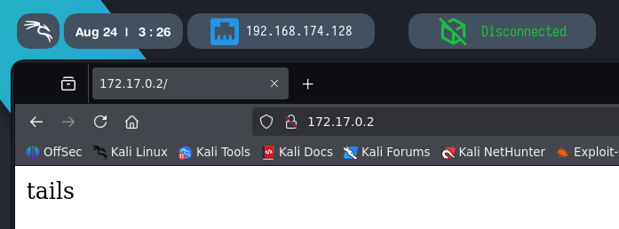
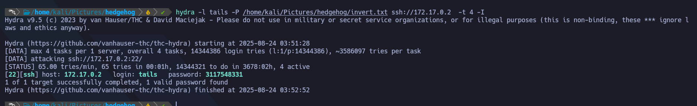
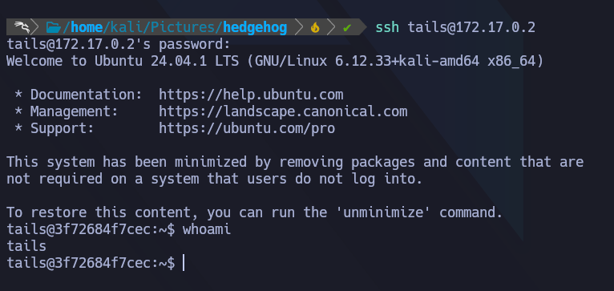
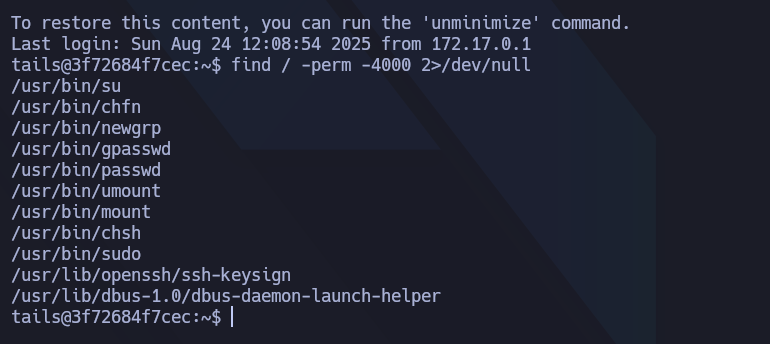
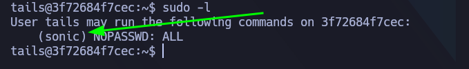
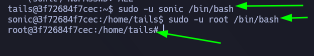

🐋 Docker Lab - Breakmyssh

Difficulty: Very Easy
SO: Linux

# Reconocimiento  
1.- Para este primer utilizaremos nmap con el siguiente comando:  
- nmap -p- --open --min-rate 5000 -n -Pn 172.17.0.2 -oG ports 

- -p- -> Muestra todos los puertos
- --open -> Muestra todos los puertos abiertos
- --min-rate 5000 -> Indica la velocidad de los paquetes, siendo esta 5000
- -n Evita la resolucion DNS
- -Pn -> Asume que todos los puertos se encuentran activos.

Aqui vemos que tenemos 2 puertos abiertos [22, 80]  
Primero veamos que hay en el puerto 80

# Explotacion  
Al ver que en la web solo tenemos un texto "tails" 
Intentemos fuerza bruta con hydra sobre el puerto 22 utilizando el texto de la web como usuario  

Una vez conectados a ssh, tenemos que escalar privilegios, buscando binarios que podamos ejecutar como root.

  

Una vez dentro, buscamos binarios SUID utilizando ''find / -perm -4000 2>/dev/null
o utilizando ''sudo -l'' 

Asi corrobarmos si encontramos binarios SUID o binarios que podamos ejecutar.
  
Ejecutando ''sudo -l'' vemos que el usuario "sonic" tiene permisos para ejecutar todo. 
  

Entramos como el usuario "sonic" y una vez dentro ejecutamos una bash como root. 
  

